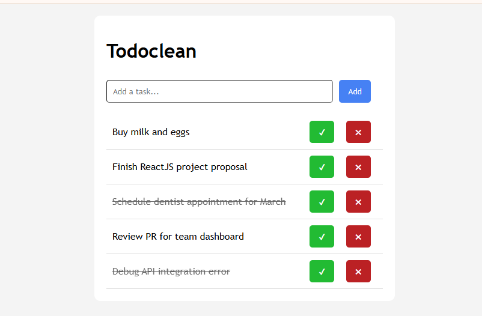

# Todoclean

## Description
Todoclean is a simple to-do list web app that helps you manage daily tasks with add, complete, and delete actions. It uses browser local storage so your task list stays available after refreshing the page.

**Live Demo:** [kamran-riyaz.github.io/shopflowz-landing-page/](https://kamran-riyaz.github.io/shopflowz-landing-page/)  
**GitHub Repo:** [https://kamran-riyaz.github.io/todoclean/](https://kamran-riyaz.github.io/todoclean/)

## Tech Stack
- HTML5: Semantic structure for the todo app layout
- CSS3: Responsive styling, button states, and simple card layout
- JavaScript: DOM manipulation, localStorage persistence, and event handling

## How to Run Locally
1. Clone or download the project files to your local machine.
2. Navigate to the project directory: `cd todoclean`
3. Open `index.html` in your web browser directly, or use a local server for a better experience.
4. Visit `http://localhost:8000` (or the appropriate URL) to view the page.

## Screenshots

## What I Learned
During this project, I learned how to use localStorage for persistent state and how to build a clean interactive UI with HTML, CSS, and vanilla JavaScript.

## For this project
- Task creation
- Task completion toggle
- Task deletion
- Local storage persistence
